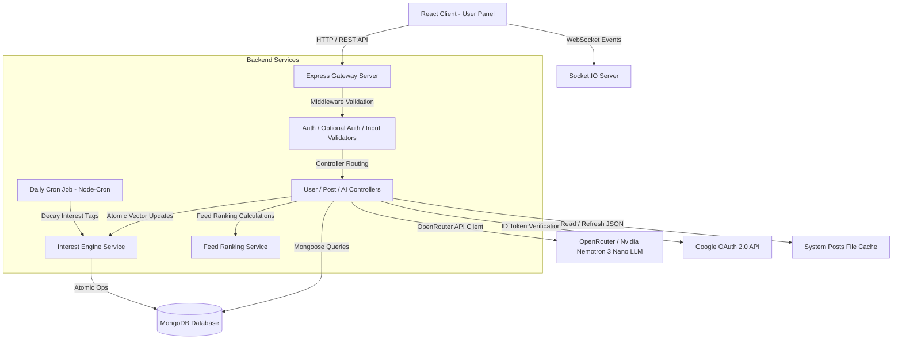
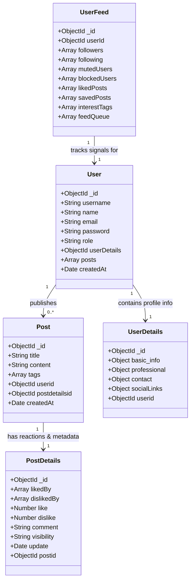
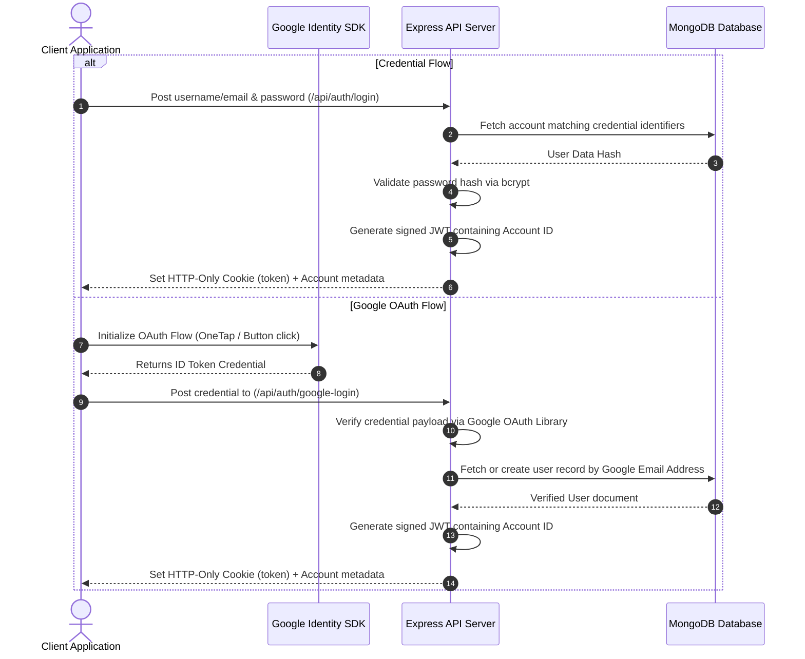
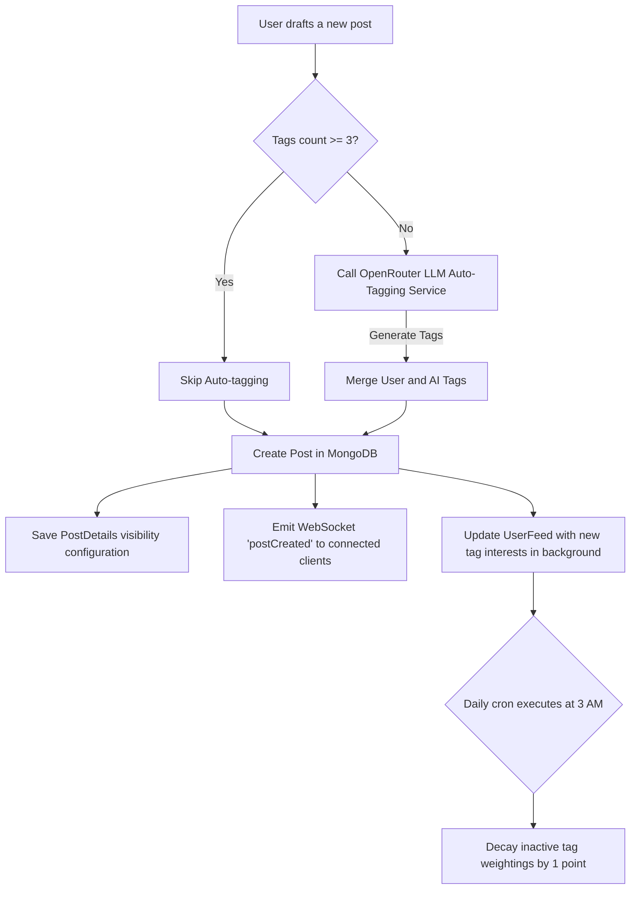

# 🧠 InsightShare - AI-Powered Collaborative Thought-Sharing Ecosystem

An intelligent, real-time thought-sharing platform built with the MERN stack that empowers users to write, refine, and catalog their ideas in collaboration with advanced AI. InsightShare features a personalized recommendations engine, real-time feed synchronization via WebSockets, and secure authentication models.

This workspace covers both the **Node.js/Express Backend API** and the **Vite-based React Frontend Web App**.

---

## 📖 Short Description
InsightShare is a modern social knowledge network designed to bridge the gap between creative writing and artificial intelligence. By integrating atomic interest tracking, real-time feed ranking, and AI co-authoring assistance, the platform enables creators to share ideas while consuming highly personalized content tailored directly to their reading behavior.

---

## ⚡ Features
- **🤖 AI Co-Author & Content Auditor**: Leverage automated co-author reviews to restructure draft content, improve titles, adjust tone, and get specific revision suggestions.
- **🏷️ Smart Auto-Tagging**: Utilizes AI-powered Natural Language Processing (NLP) to dynamically generate and inject 8–12 relevant tags when a post is created with insufficient categorizations.
- **📈 Personalized Recommendation Engine**: A custom ranking system combining content recency, creator follow status, post engagement ratios, and real-time user interest tags.
- **🔋 Atomic Interest Engine & Decay**: Real-time learning pipeline that updates interest vectors based on likes, post creation, and profile edits, backed by a scheduled daily cron job to decay interest drift over time.
- **⚡ Real-Time WebSocket Feeds**: Integrates Socket.IO to broadcast newly created content and synchronize reaction updates instantly across connected clients.
- **🔐 Secure Dual-Auth Channels**: Supports traditional credential sign-up protected by bcrypt hashing and express-rate-limit brute force mitigation, alongside a seamless Google OAuth2 integration.
- **💼 Rich Professional Profiles**: Comprehensive metadata structures mapping basic info, professional accomplishments, key skill lists, and active social media channels.

---

## 🛠️ Tech Stack

| Tier | Component | Technology Used | Key Purpose |
| :--- | :--- | :--- | :--- |
| **Frontend** | Framework | React 19 | Component-driven UI composition |
| | Build Tool | Vite | Fast HMR development and optimized production bundling |
| | Styling | TailwindCSS | Responsive utility-first design language |
| | Transitions | Framer Motion | Smooth page transitions and interactive micro-animations |
| | Forms | React Hook Form & Zod | Typed validation schemas and form state management |
| | Auth integration | @react-oauth/google | Client-side Google OAuth flow initialization |
| | State & Network | Axios & Context API | Centralized API requests and global client state management |
| **Backend** | Runtime | Node.js | Server-side JavaScript execution environment |
| | Web Framework | Express 5 | Modular route structure and request routing pipeline |
| | Database (ODM) | MongoDB & Mongoose | Document modeling, query aggregation, and relationships |
| | Real-time | Socket.IO | Bi-directional, event-based WebSocket communication |
| | Automation | Node-Cron | Scheduling internal database cleanup and interest decay scripts |
| | AI Platform | OpenRouter API Client | Access to large language models (e.g. `nvidia/nemotron-3-nano`) |
| | Security | Helmet & Express Rate Limit | API header enforcement and brute-force request restrictions |

---

## 🏗️ System Architecture



---

## 📂 Folder Structure

```
AI-Thought-Sharing webapp/
│
├── backend/                       # Express API Server
│   ├── config/                    # DB connection and Environment config
│   ├── controllers/               # Express route controller files
│   │   ├── admin/                 # Admin authentication and panel logic
│   │   └── user/                  # Core user, post, reaction, follow and AI logic
│   ├── jobs/                      # Scheduled CRON jobs (Interest Decay)
│   ├── middleware/                # Rate limiting, auth guardians, file upload controllers
│   ├── models/                    # Mongoose database schemas
│   │   └── user/                  # Core data definitions (User, Post, Feed, details)
│   ├── routes/                    # API endpoints mappings
│   │   ├── admin/                 # Protected admin management paths
│   │   └── user/                  # Public & Protected user capabilities
│   ├── services/                  # Business logic (Feed ranking, interest engine)
│   ├── setpostjson/               # Predefined system posts JSON data files
│   ├── utils/                     # Global helpers (OpenAI client, API responses, JWT)
│   ├── validators/                # Input sanitization and validators (Express Validator)
│   ├── server.js                  # App bootstrap and socket setup
│   └── package.json               # Backend dependencies and runner scripts
│
├── frontend-user/                 # React Web App
│   ├── public/                    # Static assets
│   ├── src/                       # Frontend source files
│   │   ├── api/                   # Base Axios HTTP client interceptors
│   │   ├── assets/                # Local styling & UI images
│   │   ├── components/            # Reusable UI component modules
│   │   │   ├── aiPanel/           # AI suggestions and Chatbot panels
│   │   │   ├── auth/              # Credentials and OAuth sign-in modals
│   │   │   ├── context/           # React contexts (Theme management)
│   │   │   ├── dashboard/         # Main feed cards, post details, search panels
│   │   │   ├── HeaderFooter/      # Structural layout headers and footers
│   │   │   ├── pricing/           # Pricing models display
│   │   │   └── profile/           # Profile layout, updates and stats
│   │   ├── App.jsx                # Layout routing and path configurations
│   │   ├── index.css              # Entry style point
│   │   └── main.jsx               # App entry mount configuration
│   ├── package.json               # Frontend dependencies and runner scripts
│   ├── vite.config.js             # Vite development server settings
│   └── tsconfig.json              # TypeScript compilation setup
```

---

## ⚙️ Installation Guide

### Prerequisites
- [Node.js](https://nodejs.org/) (v18.x or higher recommended)
- [MongoDB](https://www.mongodb.com/) (Local or MongoDB Atlas Cluster)
- [OpenRouter API Key](https://openrouter.ai/)
- [Google Developer Console Client Credentials](https://console.cloud.google.com/)

### Step 1: Clone the Repository
```bash
git clone https://github.com/your-username/AI-Thought-Sharing.git
cd AI-Thought-Sharing
```

### Step 2: Configure the Backend
1. Navigate to the backend directory:
   ```bash
   cd backend
   ```
2. Install dependencies:
   ```bash
   npm install
   ```
3. Create a `.env` file based on the environment variables example below.

### Step 3: Configure the Frontend
1. Navigate to the frontend-user directory:
   ```bash
   cd ../frontend-user
   ```
2. Install dependencies:
   ```bash
   npm install
   ```
3. Create a `.env` file based on the environment variables example below.

---

## 🔑 Environment Variables (.env example)

### Backend Configuration (`backend/.env`)
Create a `.env` file in the `/backend` folder with the following variables:

```ini
PORT=5000
MONGO_URI=mongodb+srv://<username>:<password>@<cluster>.mongodb.net/<dbname>
JWT_SECRET=your_super_secure_jwt_secret_key
OPENROUTER_API_KEY=your_openrouter_api_key_here
OPENROUTER_MODEL=nvidia/nemotron-3-nano-30b-a3b:free
ADMIN_EMAIL=admin@platform.com
ADMIN_PASSWORD=your_secure_admin_password
GOOGLE_CLIENT_ID=your_google_client_id.apps.googleusercontent.com
```

### Frontend Configuration (`frontend-user/.env`)
Create a `.env` file in the `/frontend-user` folder with the following variables:

```ini
VITE_API_URL=http://localhost:5000
VITE_GOOGLE_CLIENT_ID=your_google_client_id.apps.googleusercontent.com
```

---

## 🚀 Running the Project

### Start the Backend Server
From the `backend` directory, run:
```bash
# Start in development mode (with nodemon reload)
npm run dev

# Start in production mode
npm start
```
*The server will boot and start listening on port `5000` (or defined `PORT`).*

### Start the Frontend Web App
From the `frontend-user` directory, run:
```bash
# Start Vite development server
npm run dev

# Build production artifact bundles
npm run build

# Preview production builds locally
npm run preview
```
*The React client will spin up and run on `http://localhost:5173`.*

---

## 🔌 API Documentation

### 🔒 Authentication Endpoints
- `POST /api/auth/register` - Registers a new user. Initializes a default profile layout.
- `POST /api/auth/login` - Authenticates user credentials. Issues JWT inside an HTTP-only cookie.
- `POST /api/auth/google-login` - Authenticates Google OAuth accounts. Handles automatic registration for first-time logins.
- `POST /api/auth/logout` - Clears client session cookie token.

### 📝 Post & Feed Endpoints
- `GET /api/post` - Public paginated feed endpoint. Returns general published posts.
- `POST /api/post/create` - Protected route to post thoughts. Triggers the AI Auto-Tagging service and learns user interest categories.
- `GET /api/post/:postId` - Fetches specific post details.
- `GET /api/feed` - Evaluates current user interactions and interest vectors to supply a custom, ranked personalization feed.
- `GET /api/search` - Searches for posts and users using optimized partial query matching.

### 🤖 Artificial Intelligence Endpoints
- `POST /api/ai/suggest` - Brainstorms titles, improved descriptions, and related tags based on drafts.
- `POST /api/ai/chat` - Initiates interactive brainstorming with the chat co-pilot assistant.
- `POST /api/ai/review` - Processes writing drafts to fix structures, suggest vocabulary adjustments, and propose improvements.

### 👥 Follow & Interaction Endpoints
- `POST /api/followers/:followingId/toggle` - Toggles follow relationships. Dynamically adapts interest updates.
- `POST /api/system/reaction/toggle/:systemPostId` - Likes or dislikes predefined system posts. Synchronizes reactions to User Feed parameters.

---

## 📊 Database Schema Overview



---

## 🔐 Authentication Flow



---

## 🖼️ Screenshots

*Below are placeholders representation of the user dashboard interface layout.*

| Dashboard Layout (Notion-Inspired) | AI Suggestion Sidebar Modal |
| :---: | :---: |
|  <br> *Linear layout with sidebar nav, central feeds, and right-hand activity widgets.* |  <br> *Focus-mode drafting editor alongside LLM tone reviews and suggestions.* |

---

## 🔄 Project Workflow



---

## 🤖 AI Features
- **Contextual Co-Authoring**: Prompts LLMs with explicit task requirements to reorganize structure, improve vocabulary, and provide actionable tips without modifying the author's primary arguments.
- **Dynamic Descriptions**: Rewrites concise descriptions into 3 different styled previews (at least 50 words each) suitable for cards or email campaigns.
- **Automated Tag Classifier**: Automatically extracts concepts, themes, and technologies from the title and content to generate clean, lowercase hyphenated tags.
- **AI-Driven Personalization**: Feed scores dynamically scale up by `tag.score * 3` for posts containing matching interest tags learned from user behaviors.

---

## ⚡ Performance Optimizations
- **In-Memory Caching**: Implements a modular system posts cache for static JSON files (5-minute Time-To-Live). This prevents expensive, synchronous filesystem reads on every homepage feed request.
- **Atomic Database Operators**: Leverages atomic MongoDB updates (`$inc` using the positional `$` operator, guarded `$push` to prevent racing duplicates) in `updateUserInterests` instead of standard read-modify-save pipelines.
- **Query Optimization**: Uses `.lean()` and targeted `.select()` on high-traffic queries to decrease server-side document parsing overhead and save network bandwidth.

---

## 🛡️ Security Features
- **Helmet.js Integration**: Protects the application by configuring appropriate HTTP response headers, with a cross-origin resource policy enabled for static asset access.
- **Express Rate Limiters**: Prevents brute-force credential stuffing by limiting connection requests to auth paths (`10 attempts per 15-minute window`).
- **Secure Cookie Strategy**: Implements HttpOnly cookies with SameSite configurations to protect JWT transport channels against Cross-Site Scripting (XSS) and Cross-Site Request Forgery (CSRF).
- **Strict Validations**: Uses `express-validator` to enforce rigid constraints on inputs before controller methods are invoked.

---

## 🚀 Deployment

### Backend Deployment (e.g., Render, Heroku)
Ensure your deployment environment variables mirror your local development setup. You can run the production server directly using:
```bash
npm start
```

### Frontend Deployment (Vercel)
The frontend contains a `vercel.json` file in the root subdirectory to handle single-page application (SPA) client-side routing rewrites:
```json
{
  "rewrites": [
    { "source": "/(.*)", "destination": "/index.html" }
  ]
}
```
Deploy the frontend from the `frontend-user` directory directly via the Vercel CLI or through Git integration.

---

## 🔮 Future Improvements
- **Autosave Drafts**: Implement local-storage debouncing alongside database draft endpoints.
- **Vector Search / Semantic Search**: Integrate vector databases (e.g. Pinecone) to search thoughts by semantic meaning.
- **Gamification Layer**: Award experience points (XP) and badges for content publication milestones.
- **Detailed Interaction Notifications**: Live socket notifications for likes, comments, and new followers.

---

## 🤝 Contributing
Contributions are welcome! Please follow these steps to contribute:
1. Fork the Repository.
2. Create a Feature Branch (`git checkout -b feature/AmazingFeature`).
3. Commit your changes (`git commit -m 'Add some AmazingFeature'`).
4. Push to the Branch (`git push origin feature/AmazingFeature`).
5. Open a Pull Request.

---

## 📄 License
This project is licensed under the **ISC License** - see the [backend/package.json](file:///e:/Important%20Projects/AI-Thought-Sharing%20webapp/backend/package.json#L12) file for details.

---

## ✍️ Author
Designed and developed by a forward-thinking engineer passionate about building intelligent MERN architectures and real-time social applications. 

- **GitHub**: [github.com/your-username](https://github.com/)
- **LinkedIn**: [linkedin.com/in/your-username](https://linkedin.com/)
- **Website**: [your-portfolio.com](https://your-portfolio.com/)
